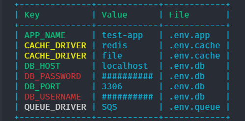

# Show

This command shows a tabular view of your environment variables and their values.

## Example
```sh
envman show production
```

## Usage
```sh
show [options] [--] [<directories>]...
```

## Arguments
Argument | Description | Default
-------- | ----------- | -------
`directories` | Directories of env files | `["."]`

## Options
Option | Description | Default
------ | ----------- | -------
`--show-only-comments` | Show only commented variables | `false`
`--show-only-duplicates` | Show only duplicate variables | `false`
`--show-only-encrypted` | Show only encrypted variables | `false`
`--show-only-regular` | Show only regular variables | `false`

## Notes
- Each environment variable classification has a distinct color to identify them easily.
    - Comments: White
    - Duplicates: Yellow
    - Encrypted: Red
    - Regular: Default terminal color


